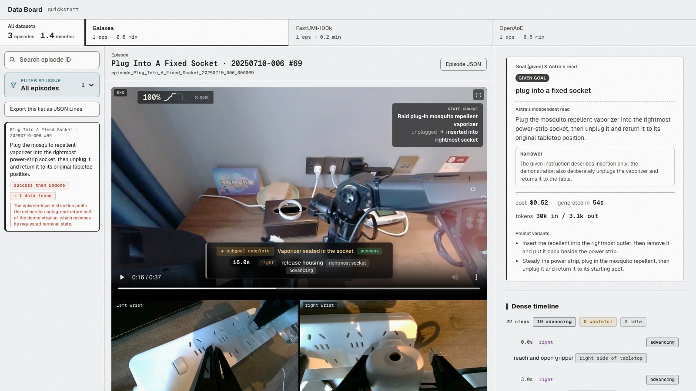

# robot-data-audit

Dense annotations and data-quality checks for robot-learning episodes, from Pantheon.

This is the pipeline behind [*We Looked at Everything*](https://pantheon.inc/research/we-looked-at-everything), in which we audited 3,546 episodes (66.5 hours) across nine public datasets. Every annotation can be browsed on the [data dashboard](https://pantheon.inc/data-board), and [Data Review](https://pantheon.inc/data-review) runs the same pipeline on data you upload.

The pipeline handles teleoperated arms, UMI grippers and head-mounted cameras, and reads LeRobot datasets, MCAP files, plain video and archives of any of these. It draws on instructions and recorded robot state when a dataset provides them, and works from the footage alone when it does not. For each episode it produces a dense timeline with

- every action marked as advancing the task, wasteful or idle
- progress toward the goal, key events and subgoals
- the outcome, and whether the instruction matches what was actually done
- operator mistakes, and whether and how the operator recovered
- changes a person made to the scene

Deterministic checks run alongside the model to catch what a model should not be trusted to judge, such as recordings that play faster than real time, camera streams swapped between arms, gripper signals that never change, and poor capture.

The harness primarily uses Astra (`openai/gpt-6-astra`). For each setup it chooses which frames to send and at what resolution, decodes them at exact timestamps, and prompts the model with what the setup is, what counts as a mistake on it, and how to verify what the recording claims against the pixels. All prompts live in `label/`. The repository also includes the dashboard, a comparison of four models on the same harness, and `gate/`, the regression suite the harness is held to.



## Install

```bash
git clone git@github.com:Pantheon-Industries-Inc/robot-data-audit.git && cd robot-data-audit
uv sync --frozen
export OPENROUTER_API_KEYS=sk-or-...    # comma-separated, or set OPENAI_API_KEY to call OpenAI directly
uv run pytest                           # offline, no model calls
```

You also need `ffmpeg` 5.1 or newer. With only an OpenAI key the pipeline still runs in full, since both models it calls are OpenAI's, while the comparison's other models need OpenRouter. Costs are then estimated from list prices, because OpenAI does not return a billed cost. ABC-130k, 10Kh-RealOmin, Egocentric-100K and Gen-HumanEgo are gated on Hugging Face, so accept their terms and set `HF_TOKEN`. All output goes under `data/`, which git ignores.

## Quickstart

The quickstart labels one episode from each setup for about $1 in total. The MolmoAct2 episode first downloads about 1.4 GB of camera video.

```bash
# teleop: MolmoAct2, two arms push four blocks into a row, then push it apart (37 s)
uv run python -m prepare molmo prepare --episodes configs/quickstart/teleop.txt --out data/episodes/molmo/quickstart
uv run python -m checks data/episodes/molmo/quickstart
uv run python -m label --dataset molmo --episodes data/episodes/molmo/quickstart --kind smoke --cap 2

# UMI: FastUMI, a gripper opens a toilet lid (11.5 s)
uv run python -m prepare fastumi prepare --episodes configs/quickstart/handheld.txt --out data/episodes/fastumi/quickstart
uv run python -m checks data/episodes/fastumi/quickstart
uv run python -m label --dataset fastumi --episodes data/episodes/fastumi/quickstart --kind smoke --cap 2

# human ego: OpenAoE, a head-mounted phone (34 s)
uv run python -m prepare openaoe prepare --episodes configs/quickstart/head_camera.txt --out data/episodes/openaoe/quickstart
uv run python -m checks data/episodes/openaoe/quickstart
uv run python -m label --dataset openaoe --episodes data/episodes/openaoe/quickstart --kind smoke --cap 2

# a dashboard over the three runs, at http://localhost:8896
mkdir -p data/boards/quickstart && cp configs/quickstart/board.json data/boards/quickstart/manifest.json
uv run python -m board build data/boards/quickstart
for ds in molmo fastumi openaoe; do uv run python -m board clips --episodes data/episodes/$ds/quickstart --out data/clips; done
uv run python -m board serve --board data/boards/quickstart --clips data/clips
```

Expect the MolmoAct2 episode to come out as a success then undone, with the row complete near 18 s and pushed apart near 30 s, the FastUMI episode as a success with the lid open near 7 s, and the OpenAoE clip as a few activities, each a success. A bare video works the same way through `prepare videos --rig RIG` with no instructions file, and the model then names the task itself.

## Layout

| Folder | Contents | Entry point |
|---|---|---|
| `prepare/` | One adapter per dataset, and the reader for your own data that Data Review also runs | `python -m prepare <adapter>` |
| `checks/` | Deterministic checks, and the label consistency check | `python -m checks` |
| `label/` | The harness, with frame selection, exact decoding, resolution routing, per-setup prompts, the model call, runs | `python -m label` |
| `board/` | The dashboard, served live or written as static files, and the hand pose overlay | `python -m board` |
| `compare/` | Other models on the same episodes and harness, with and without an Astra example in context | `python -m compare` |
| `gate/` | The regression suite, frame-verified cases and a cost sample per setup | `python -m gate` |
| `configs/` | Episode lists, the quickstart, model settings, example annotations | |

Every command takes `--help`, and each module's docstring is its full reference. `tests/` has one file per stage.

## Prepare

An adapter reads a dataset and writes one sidecar folder per episode that points at the dataset's own video files, so nothing is re-encoded and the harness decodes frames straight from the source at exact timestamps.

```bash
uv run python -m prepare folder prepare --root path/to/data --rig teleop_arms --out data/episodes/mine/all       # anything Data Review accepts
uv run python -m prepare lerobot prepare --root path/to/dataset --rig teleop_arms --out data/episodes/mine/all
uv run python -m prepare videos prepare --root path/to/videos --rig ego_head --instructions instructions.json --out data/episodes/mine/all
uv run python -m prepare molmo prepare --episodes configs/slices/molmo.txt --out data/episodes/molmo/slice      # the episodes we audited
```

`--rig` is `teleop_arms`, `handheld_gripper` or `ego_head`. `folder`, `lerobot` and `videos` all go through `prepare/formats.py`, the same reader Data Review runs on uploads. The reader hands a dataset it recognizes to that dataset's adapter, which keeps what the dataset records beyond video, such as ABC-130k and RealOmin robot state, Gen-HumanEgo goals and timed steps, and the meaning of HABIT and Galaxea columns. Any other MCAP contributes its cameras and text channels, with the task topic as the instruction and, on a head camera, a step topic such as `/task/subtask` as timed steps. Any other LeRobot dataset maps video features to cameras by name and reads `observation.state` and `action` when they carry 7 values per arm or gripper. A `.txt` or `.json` beside a video reaches the model as your annotation, and the `videos` instructions file maps each path to an instruction or, for human ego video, to `{"instruction": ..., "subtasks": [{"t0": 0.0, "t1": 4.5, "label": "..."}]}`.

To support another format, write an adapter against the functions in `prepare/formats.py`, whose docstring documents every file and field (`prepare/openaoe.py` is the smallest adapter). An adapter that declares `UPLOAD = "mcap"` or `UPLOAD = "lerobot"` and implements `recognizes` and `convert_upload` is discovered automatically, so `folder`, `lerobot` and Data Review read that dataset through it with no other change (see `prepare/genhumanego.py` and `prepare/habit.py`). Every adapter must declare `UPLOAD`, and the tests enforce it.

Each public adapter downloads exactly the episodes in its list. `configs/slices/<adapter>.txt` is the list we audited, with the command and seed that drew it in its header.

| Dataset | Setup | Adapter | `configs/slices` |
|---|---|---|---|
| allenai/MolmoAct2-BimanualYAM-Dataset | teleop | `molmo` | 1,284 episodes, 25.1 h, all 34 tasks |
| XDOF/ABC-130k | teleop | `abc130k` | 183 episodes, 5.9 h, one per task |
| RogersPyke/Galaxea-Open-World-Dataset_10K_20260123 | teleop | `galaxea` | 222 episodes, 5.7 h, 111 collections |
| configinc/HABIT | teleop | `habit` | 315 episodes, 5.1 h, 5 per task |
| IPEC-COMMUNITY/FastUMI_100k_lerobot | UMI | `fastumi` | 964 episodes, 4.8 h, 32 per task |
| genrobot2025/10Kh-RealOmin-OpenData | UMI | `realomin` | 280 episodes, 5.5 h, round robin over task folders |
| builddotai/Egocentric-100K | human ego | `egocentric100k` | 112 clips, 5.6 h, one per worker |
| genrobot2025/Gen-HumanEgo | human ego | `genhumanego` | 79 episodes, 3.5 h, uniform random |
| inclusionAI/OpenAoE-2000h | human ego | `openaoe` | 107 clips, 5.7 h, one per recording |

## Checks

`python -m checks EPISODES` writes each result into the episode's `context.json`. The dashboard shows the results, and none of them reach the prompt.

- `stream_pairing` detects camera files swapped between arms by testing whether each mounted camera's image motion follows its own arm's recorded motion or the other arm's.
- `recorded_jumps` finds single-frame jumps in the recorded pose that the actor's own camera does not show.
- `gripper_channels` flags a recorded gripper opening that never changes.
- `capture_qc` runs the 38 capture checks from public-dataset-adapter (clock gaps, exposure, frozen or duplicated frames, recorded motion the video does not show), with each per-setup threshold justified in `checks/capture_qc.py`.
- `label_consistency` flags labels that contradict themselves, such as a success whose goal alignment says only part of the task was done, or a failure whose progress reaches 1.0. It runs inside `board build` and never edits a label.

Detecting MolmoAct2 recordings that play faster than real time requires comparing neighbouring episodes, so `checks.timebase` scans the whole dataset's parquets once and then applies the result to prepared episodes.

```bash
uv run python -m checks.timebase scan --raw data/raw/molmo --out data/molmo_timebase.csv
uv run python -m checks.timebase apply --timebase data/molmo_timebase.csv EPISODES
```

## Label

```bash
uv run python -m label --dataset molmo --episodes data/episodes/molmo/slice --kind full --cap 900
```

`--kind dry` builds every request without sending it, and `smoke` is a small paid run to inspect before a full one. Paid runs refuse a dirty checkout so that every label traces to a commit, and stop starting episodes once `--cap` dollars are spent. Arguments after `--` go to the harness, for example `-- --model anthropic/claude-opus-5.5`. Each run writes `data/runs/<dataset>/<time>_<kind>_<commit>/`, with `run.json` (command, settings, cost per footage hour) and one `out/<episode>.json` per episode holding the labels, exactly what was sent, the checks, what served the request and the billed usage. A reply that does not parse is kept verbatim and never retried. `--resume RUN --why "..."` finishes a killed run, and `python -m label.reparse RUN` re-parses stored replies with the current parser.

The harness samples one instant every 1.5 s on teleop arms, every 1 s on UMI grippers and every 0.5 s on human ego video, plus the first and last frames, and tiles four instants per grid image with one row per camera and each column headed with its exact time. UMI cells are 320 px wide and human ego cells 256 px. On teleop, GPT-6 Sol reads only the task text and decides whether the task needs fine detail, such as lettering, which face of an object is up, or small similar objects. Those episodes get 448 px cells on every camera, and the rest get 224 px cells plus contact views, which show the scene camera and the acting arm's camera at detail size just after each sharp change in the recorded gripper value. A request over the provider's image-size limit steps down to narrower cells until it fits.

The prompt opens with the shared instructions and the episode's facts (cameras, recorded still spans and motion, the instruction and the objects it names), each framed as a claim to check, followed by the grids and then the first and last instants at up to 768 px. Without an instruction, the model names the task as the most specific end state the demonstrator worked toward. The shared instructions are pinned by hash in `tests/test_label.py`. Measured on the gate's cost samples as first sends, labelling costs about $26 per footage hour on teleop, $30 on UMI and $19 on human ego video.

Everything up to the model call is deterministic, down to byte-identical requests, since episode lists are fixed files, packages are pinned in `uv.lock`, frames are decoded at exact timestamps and the grid font ships in `label/fonts/`. The calls send no temperature, top_p, seed or provider pin, and each output records `provider_name`, `model_served`, `system_fingerprint` and `generation_id`, because model ids are not dated snapshots. Labels are not bit-reproducible, so compare runs by their fields. Labelled three times each, the quickstart episodes got the same outcome every time, with goal and undo times within 5 s.

## Dashboard

```bash
mkdir -p data/boards/mine && cp configs/quickstart/board.json data/boards/mine/manifest.json   # then edit it
uv run python -m board build data/boards/mine
uv run python -m board clips --episodes data/episodes/mine/all --out data/clips
uv run python -m board serve --board data/boards/mine --clips data/clips
uv run python -m board static media --board data/boards/mine --clips data/clips   # static build, video and frames
uv run python -m board static site --board data/boards/mine --clips data/clips    # static build, page and data
```

A dashboard shows the runs named in its `manifest.json`, one `{"dataset", "run", "episodes", "rules"}` entry per dataset, and `board/build.py` documents every key and rule. An issue counts as a problem when it is a data issue or an outcome-changing operator mistake of medium or high severity, or any issue of high severity. The rest stay visible as minor, and each problem belongs to one family in `board/families.json`. A partial outcome is shown as a failure, and success then undone as a success. Episodes download as JSON and filtered lists as JSON Lines, and `board/publish.sh` uploads a static build.

Human ego episodes can also show 2D hand keypoints from [ACE-Ego-Hand](https://github.com/ggxxii/ACE-Ego-Hand), computed on Modal GPUs by `board/hand_pose/modal_app.py` (you register for and download MANO yourself) and added through the manifest's `hands` key. The keypoints are for non-commercial use only.

## Model comparison

Four models label the same 193 episodes (about an hour per setup, `configs/compare/main.json`) with the same harness, prompt, images, reasoning effort and output limit (`configs/models.json`). They are Astra as the reference, Claude Opus 5.5, GPT-6 Sol and DeepSeek v4.1 flash. With `--with-example`, the other three also see one complete Astra annotation of a different episode of the same setup (`configs/examples/`), on a seeded third of the episodes (`configs/compare/third.json`).

```bash
uv run python -m compare prepare --selection configs/compare/main.json
uv run python -m compare label --selection configs/compare/main.json --kind full --cap 100
uv run python -m compare label --selection configs/compare/third.json --with-example --kind full --cap 15
uv run python -m compare board --entries data/runs/compare/main.json data/runs/compare/third_ex.json --out data/boards/compare
uv run python -m board build data/boards/compare
uv run python -m compare.metrics data/boards/compare
```

Each `label` starts one run per model, each under its own `--cap`. In our run, Claude Opus 5.5, GPT-6 Sol and DeepSeek v4.1 flash cost 34%, 19% and 4% as much per episode as Astra. The dashboard counts only the reference model's labels, and its "Labels by" control switches to any other model's.

## Gate

```bash
uv run python -m gate prepare
uv run python -m gate label --kind full --cap 40     # one run per setup, about $60 in all
uv run python -m gate score data/runs/gate_teleop/RUN data/runs/gate_handheld/RUN data/runs/gate_ego/RUN
```

The gate holds 126 episodes (`gate/selection.json`) and, for each case, what its label must say, every fact checked on the frames (`gate/cases.json`). The cases include MolmoAct2 1346 (asked to flip three blocks, none ever turns), 008276 (black polo shirts under an instruction to fold black pants) and all 32 FastUMI Prepare_tableware episodes (a fork is handled, never chopsticks). Each setup also has a cost sample of about 20 episodes. A harness passes when every reply parses, no label contradicts itself, the cases hold and cost stays within the figures under Label. The current harness scores 19 of 22 on teleop, 36 of 36 on UMI and 7 of 7 on human ego.

## Credits

The capture checks in `checks/vendor/public_dataset_adapter_qc.py` are Sambhav Gupta's, from public-dataset-adapter (commit 99d0a9e), with the changes listed in that file's header. The hand pose model is ACE-Ego-Hand (Yufei Liu et al., [arXiv:2608.20308](https://arxiv.org/abs/2608.20308)), built on Wan2.2, VideoX-Fun and MANO (Romero, Tzionas and Black, 2017).

## Licenses

The code is Apache-2.0 (`LICENSE`), and the few files that carry material under another license are listed in `THIRD_PARTY_NOTICES.txt`. The components below are downloaded at run time and are not included here. The labels Pantheon publishes, on the data dashboard, in its downloads and in the release, are licensed [CC BY 4.0](https://creativecommons.org/licenses/by/4.0/), so anyone may use them for any purpose with credit to Pantheon. The footage they describe keeps its dataset's license.

| Component | License | Source |
|---|---|---|
| ACE-Ego-Hand code (commit 9757868) | MIT | [github.com/ggxxii/ACE-Ego-Hand](https://github.com/ggxxii/ACE-Ego-Hand/blob/97578680931b3f1c8111396c100d595b98857fb8/LICENSE) |
| ACE-Ego-Hand checkpoints (`ace_ego_hand_k.pt`, `ace_ego_hand_kfree.pt`) | CC BY-NC 4.0, non-commercial | [huggingface.co/acerobotics2025/ACE-Ego-Hand](https://huggingface.co/acerobotics2025/ACE-Ego-Hand) |
| Wan2.2-Fun-5B-Control (weights, VAE, umT5-XXL text encoder and tokenizer) | Apache-2.0 | [huggingface.co/alibaba-pai/Wan2.2-Fun-5B-Control](https://huggingface.co/alibaba-pai/Wan2.2-Fun-5B-Control) |
| VideoX-Fun (commit 968f0e2) | Apache-2.0 | [github.com/aigc-apps/VideoX-Fun](https://github.com/aigc-apps/VideoX-Fun) |
| smplx 0.1.28 | Max Planck license for non-commercial scientific research | [github.com/vchoutas/smplx](https://github.com/vchoutas/smplx/blob/main/LICENSE) |
| MANO (you register and download it yourself) | Max Planck license for non-commercial scientific research, no redistribution | [mano.is.tue.mpg.de/license.html](https://mano.is.tue.mpg.de/license.html) |
| Python packages in `uv.lock` | BSD, MIT, Apache-2.0, PSF, MPL-2.0 (certifi, tqdm) | PyPI |
| MolmoAct2-BimanualYAM-Dataset (Ai2) | Apache-2.0 | [allenai/MolmoAct2-BimanualYAM-Dataset](https://huggingface.co/datasets/allenai/MolmoAct2-BimanualYAM-Dataset) |
| ABC-130k (XDOF) | Apache-2.0 | [XDOF/ABC-130k](https://huggingface.co/datasets/XDOF/ABC-130k) |
| Galaxea Open-World Dataset (Galaxea) | CC BY-NC-SA 4.0, non-commercial | [OpenGalaxea/Galaxea-Open-World-Dataset](https://huggingface.co/datasets/OpenGalaxea/Galaxea-Open-World-Dataset); the adapter reads the copy at `RogersPyke/Galaxea-Open-World-Dataset_10K_20260123`; accept Galaxea's terms on its page before using it |
| HABIT (Config) | CC BY 4.0 | [configinc/HABIT](https://huggingface.co/datasets/configinc/HABIT) |
| FastUMI-100K | Apache-2.0 | [IPEC-COMMUNITY/FastUMI_100k_lerobot](https://huggingface.co/datasets/IPEC-COMMUNITY/FastUMI_100k_lerobot) |
| 10Kh-RealOmin-OpenData (GenRobot) | CC BY-SA 4.0 | [genrobot2025/10Kh-RealOmin-OpenData](https://huggingface.co/datasets/genrobot2025/10Kh-RealOmin-OpenData) |
| Egocentric-100K (Build AI) | Apache-2.0 | [builddotai/Egocentric-100K](https://huggingface.co/datasets/builddotai/Egocentric-100K) |
| Gen-HumanEgo (GenRobot) | CC BY-SA 4.0 | [genrobot2025/Gen-HumanEgo](https://huggingface.co/datasets/genrobot2025/Gen-HumanEgo) |
| OpenAoE-2000h (inclusionAI) | Open-AoE Dataset License, attribution required; its MANO-derived files, which the adapter never reads, also fall under MANO's license | [inclusionAI/OpenAoE-2000h](https://huggingface.co/datasets/inclusionAI/OpenAoE-2000h/blob/main/LICENSE) |

Running a dataset through this pipeline does not change its license, so credit each dataset as its license asks when you publish its footage or labels. The hand keypoints come from the ACE-Ego-Hand checkpoints (CC BY-NC 4.0) and a model built on MANO (non-commercial research only), so use them only for non-commercial purposes and credit ACE-Ego-Hand.
